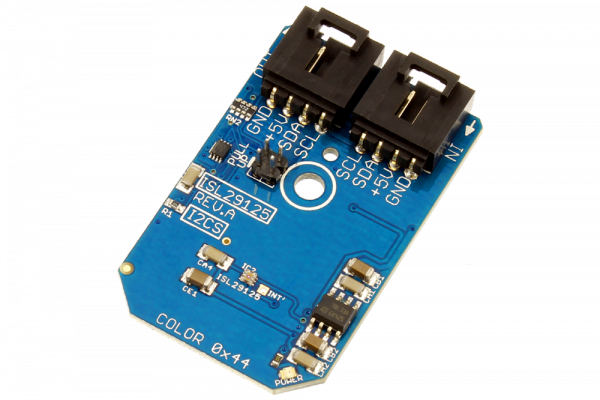

# ISL29125

Intersil’s ISL29125 is a low power, high sensitivity RGB color light sensor with an I2C interface.Its state-of-the-art photodiode array provides an accurate RGB spectral response and excellent light source to light source variation (LS2LS).The ISL29125 is designed to reject IR in light sources allowing the device to operate in sunlight or dark rooms. The integrating ADC rejects 50Hz and 60Hz flicker caused by artificial light sources.
This Device is available from www.ncd.io 

[SKU: ISL29125_I2CS]

(https://store.ncd.io/product/isl29125-digital-red-green-blue-color-light-sensor-with-ir-blocking-filter-i2c-mini-module/)
This Sample code can be used with Arduino.

Hardware needed to interface ISL29125 sensor with Arduino

1. <a href="https://store.ncd.io/product/i2c-shield-for-arduino-nano/">Arduino Nano</a>

2. <a href="https://store.ncd.io/product/i2c-shield-for-arduino-micro-with-i2c-expansion-port/">Arduino Micro</a>

3. <a href="https://store.ncd.io/product/i2c-shield-for-arduino-uno/">Arduino uno</a>

4. <a href="https://store.ncd.io/product/dual-i2c-shield-for-arduino-due-with-modular-communications-interface/">Arduino Due</a>

5. <a href="https://store.ncd.io/product/isl29125-digital-red-green-blue-color-light-sensor-with-ir-blocking-filter-i2c-mini-module/">ISL29125 Digital Red Green Blue Color Light Sensor with IR Blocking Filter</a>

6. <a href="https://store.ncd.io/product/i%C2%B2c-cable/">I2C Cable</a>

ISL29125:

Intersil’s ISL29125 is a low power, high sensitivity RGB color light sensor with an I2C interface.Its state-of-the-art photodiode array provides an accurate RGB spectral response and excellent light source to light source variation (LS2LS).The ISL29125 is designed to reject IR in light sources allowing the device to operate in sunlight or dark rooms. The integrating ADC rejects 50Hz and 60Hz flicker caused by artificial light sources.

Applications:

• Smart phone, PDA, GPS, tablet PCs, LCD-TVs, digital picture frames, digital cameras

• Dynamic display color balancing

• Printer color enhancement

• Industrial/commercial LED lighting color management

• Ambient light color detection/correction

• OLED display aging compensation.

How to Use the ISL29125 Arduino Library

The ISL29125 has a number of settings, which can be configured based on user requirements.
          
1.ADC Resolution setting:The following command is used to set the resolution of ISL29125 Light sensor.

             isl.setResolution(RESOLUTION_16);       // 16 Bits
            
2.Sensing range:The Full Scale RGB Range has two different selectable ranges at bit 3.The range determines the ADC resolution (12 bits and 16 bits). Each range has a maximum allowable lux value. Higher range values offer better resolution and wider lux value.

             isl.setRange(RANGE_10KLUX);             // 10,000 lux
              
3.RGB oparating mode:The following command is used to set the operating mode for red,green,blue colors.          
              
            isl.setMode(MODE_RGB);                  // GREEN/RED/BLUE
              
